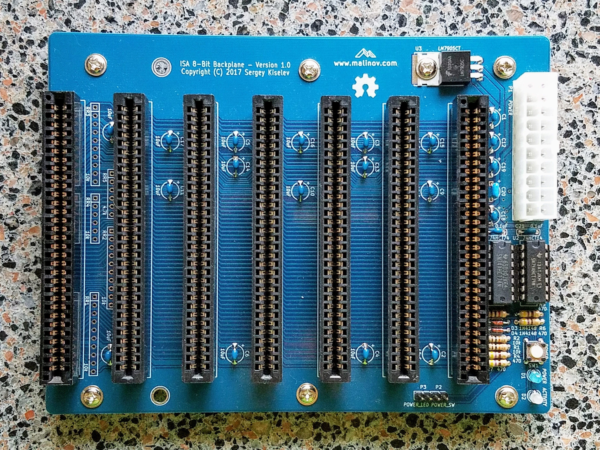

# ISA 8-bit Backplane
Compact ISA 8-bit Backplane board

## Introduction
This backplane was designed as a smaller version of [Micro ATX ISA Backplane](https://www.retrobrewcomputers.org/doku.php?id=boards:isa:isa-backplane:start). It can be used to build a compact IBM PC/XT compatible system using the [Micro 8088](https://github.com/skiselev/micro_8088)
processor board, and the 8-bit ISA cards that I've designed:
[ISA Super VGA](http://www.malinov.com/Home/sergeys-projects/isa-supervga),
[ISA Floppy Disk and Serial Controller](http://www.malinov.com/Home/sergeys-projects/isa-fdc-and-uart),
[XT-CF-Lite](http://www.malinov.com/Home/sergeys-projects/xt-cf-lite),
[ISA OPL2](http://www.malinov.com/Home/sergeys-projects/isa-opl2-card).

## Specifications
* 7 ISA 8-bit (62 pin) slots
* ATX power supply connector, and ATX power control circuit
* Bi-color activity LED, that changes the color when the processor is executing the code (the color changes every time A7 address line changes its value)
* The form factor is (mostly) compatible with ATX / Micro ATX
* Pads for optional termination resistors

## Hardware Documentation

### Schematic and PCB Layout

[Schematic - Version 1.0](KiCad/ISA8_Backplane-Schematic-1.0.pdf)

[PCB Layout - Version 1.0](KiCad/ISA8_Backplane-Board-1.0.pdf)

### Building Insturctions

Please refer to [Building Instructions](Building_Instructions.md) page for detailed instructions.

### Jumpers, Connectors, and Switches

#### P1 - ATX power connector
Pin | Description                    | Pin | Description
--- | ------------------------------ | --- | ------------------------------
1   | +3.3V power supply (not used)  | 11  | +3.3V power supply (not used)
2   |	+3.3V power supply (not used)  | 12  | -12V power supply
3   |	GND                            | 13  | Ground
4   |	+5V power supply               | 14  | Power supply ON signal
5   |	Ground                         | 15  | Ground
6   |	+5V power supply               | 16  | Ground
7   | Ground                         | 17  | Ground
8   | Power good (not used)          | 18  | -5V power supply (not used)*
9   | +5V standby power supply       | 19  | +5V power supply
10  | +12V power supply              | 20  | +5V power supply

*Note: -5V is not provided by most ATX power supplies. It is generated using an on board voltage regulator instead*

#### P2 - Power Switch connector
Pin | Description
--- | -----------
1   | Ground
2   |	Power ON signal

#### P3 - Power LED connector
Pin | Description
--- | -----------
1   | LED+
2   |	Ground

#### SW1 - Power Switch
Press SW1 to turn power on or off. The SW1 is connected in parallel with P2

### Bill of Materials - Version 1.0

[ISA 8-bit Backplane project on Mouser.com](https://www.mouser.com/ProjectManager/ProjectDetail.aspx?AccessID=9a09040b52) - View and order all components except of the PCB.

[ISA 8-bit Backplane project on OSH Park](https://oshpark.com/shared_projects/Y8dcyt5m) - View and order the PCB.

Component type     | Reference | Description                       | Quantity | Possible sources and notes 
------------------ | --------- | --------------------------------- | -------- | --------------------------
PCB                |           | ISA 8-bit Backplane PCB - Version 1.0  | 1   | Refer to the [RetroBrew Computers Board Inventory](https://retrobrewcomputers.org/doku.php?id=boardinventory#xi_8088_project_sergey_kiselev) page for ordering information, or order from a PCB manufacturer of your choice using provided Gerber or KiCad files
Integrated Circuit | U1        | 74HCT74, DIP-14 package           | 1        | Mouser [595-SN74AHCT74N](https://www.mouser.com/ProductDetail/595-SN74AHCT74N)
Integrated Circuit | U2        | 74HCT14, DIP-14 package           | 1        | Mouser [595-SN74AHCT14N](https://www.mouser.com/ProductDetail/595-SN74AHCT14N)
Integrated Circuit | U3        | LM7905C -5V voltage regulator     | 1        | Mouser [512-LM7905CT](https://www.mouser.com/ProductDetail/512-LM7905CT)
IC Socket          | U1, U2    | DIP-14, 300 mil socket            | 2        | Mouser [517-4814-3000-CP](https://www.mouser.com/ProductDetail/517-4814-3000-CP)
LED                | D1        | 3 mm, blue LED indicator          | 1        | Mouser [696-SSL-LX3054USBD](https://www.mouser.com/ProductDetail/696-SSL-LX3054USBD)
LED                | D2        | 3 mm, bi-color red/green LED indicator | 1   | Mouser [696-SSL-LX3054IGW](https://www.mouser.com/ProductDetail/696-SSL-LX3054IGW)
Diode              | D3, D4    | 1N4148                            | 2        | Mouser [512-1N4148](https://www.mouser.com/ProductDetail/512-1N4148)
Tactile Button     | SW1       | 6 mm tactile button, straight     | 1        | Mouser [653-B3F-1000](https://www.mouser.com/ProductDetail/653-B3F-1000)
Connector          | P1        | 20 pin ATX power connector        | 1        | Mouser [538-46015-2006](https://www.mouser.com/ProductDetail/538-46015-2006)
Connector          | P2, P3    | 4 pin header, 2.54 mm pitch       | 2        | Mouser [649-68002-104HLF](https://www.mouser.com/ProductDetail/649-68002-104HLF)
Connector          | BUS1-BUS7 | 62 pin card edge connector, 2.54 mm pitch | 7 | Mouser [571-6-5530843-5](https://www.mouser.com/ProductDetail/571-6-5530843-5)
Capacitor          | C1 - C19  | 10 uF, 16V, MLCC, 5 mm lead spacing    | 19       | Mouser [810-FG28X5R1E106MR06](https://www.mouser.com/ProductDetail/810-FG28X5R1E106MR06)
Capacitor          | C20       | 1 uF, MLCC, 5 mm lead spacing     | 1        | Mouser [810-FG28X5R1H105KRT0](https://www.mouser.com/ProductDetail/810-FG28X5R1H105KRT0)
Capacitor          | C21, C22  | 0.1 uF, MLCC, 5 mm lead spacing   | 2        | Mouser [594-K104K15X7RF53H5](https://www.mouser.com/ProductDetail/594-K104K15X7RF53H5)
Resistor           | R1, R2    | 10 kohm, through hole             | 2        | Mouser [291-10K-RC](https://www.mouser.com/ProductDetail/291-10K-RC)
Resistor           | R3        | 1 kohm, through hole              | 1        | Mouser [291-1K-RC](https://www.mouser.com/ProductDetail/291-1K-RC)
Resistor           | R4 - R7   | 470 ohm, through hole             | 4        | Mouser [291-470-RC](https://www.mouser.com/ProductDetail/291-470-RC)
Resistor Array     | RR1 - RR5 | do not populate                   |          | Optional, should not be populated

